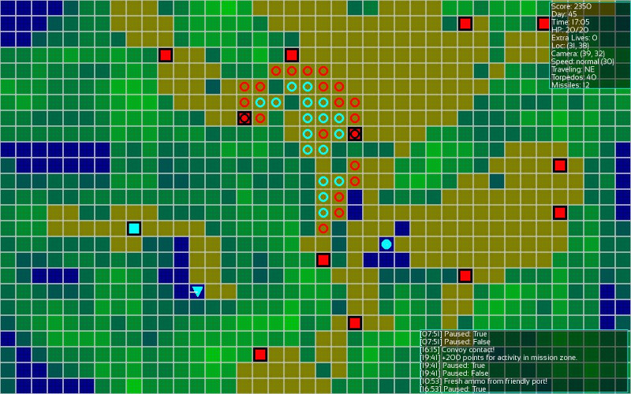
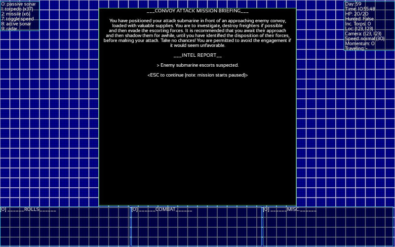

# BLOCKADE 

**Status / Progress**: Currently the campaign is playable in its entirety, although a great many features have yet to be implemented. Most recently, I have transitioned the game from turn-based to real-time-pausable. Time compression and perhaps mouse controls will be incoming in the near future to make the most of the advantages gained by this. More mechanical features incoming soon, for sure.

**Version**: 0.0.0

**Description**: I am making a traditional Roguelike disguised as a Subsim, with the intent that it eventually be cozy to play with a plug-and-play controller. The goal is something in between Cold Waters and Silent Hunter, although set in a non-historical universe (procedurally generated each campaign, and likely with varying levels of technology between them), and which plays in the manner of a traditional Roguelike (a comparison can also be made to games like XCOM, Invisible Inc., and tactical wargames in general). Early, early stages. The stats-and-rolling system are a loosely adapted take on the way GURPS handles things, because that's pretty sweet. 

This game isn't intended to be a super accurate representation of submarine warfare (in which I'm not an expert). The goal is something that is close-ish, in a cartoon or anime-like way, at most. It takes place on a fictional earth-like world, of as-yet-unfleshed-out lore and fluff. Most of the stats are placeholder stats which for now just serve to test the mechanics. Much testing will be done to ensure the best values later on.

